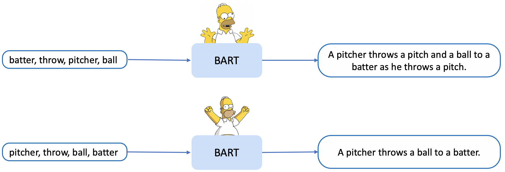
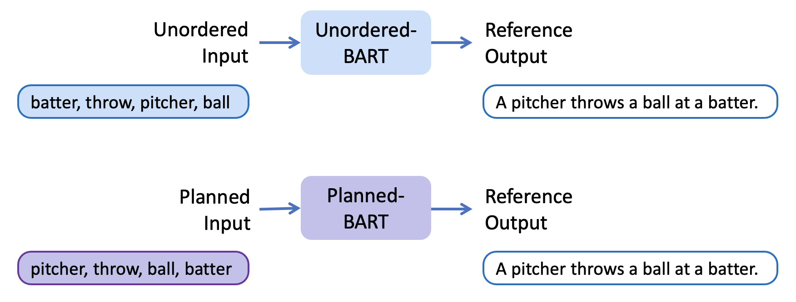
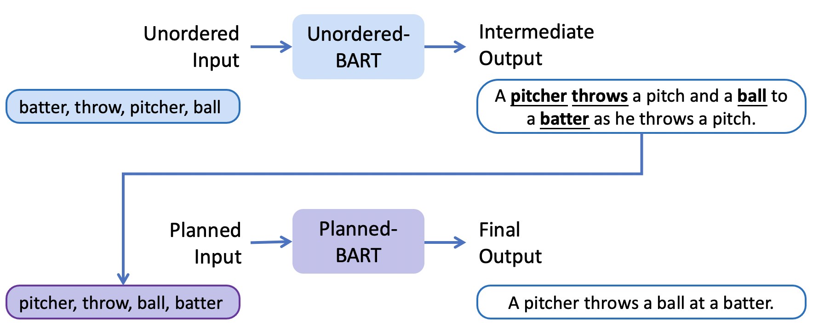

## Planned-PTM

This is the codebase of our NAACL22 Findings Paper [Revisiting Generative Commonsense Reasoning: A Pre-Ordering Approach](https://arxiv.org/abs/2205.13183).

We find that in keywords-to-text generation tasks, the order of keywords can significantly impact the generation quality of Pre-trained LMs. 
We therefore propose a simple pre-ordering approach to elaborately manipulate the order of the input keywords before generation. 




The code is inherited from [KG-BART](https://github.com/yeliu918/KG-BART), 
which is based on [Huggingface Transformer](https://github.com/huggingface/transformers). 
We only followed the implementation of the vanilla BART model. 
We thank the authors for their effort to make these implementations public.

### Step 1. Data Preparation

#### 1.1. Put train/dev/test set under the `dataset/` folder.

We use [CommonGen](https://inklab.usc.edu/CommonGen/) as the dataset to conduct experiments in the paper.
We provide toy examples under this folder to demonstrate the data format.

#### 1.2. Create oracle plans for each data subset.

```shell script
for data_split in train dev test
do
    python src/data/create_plan.py --src_file dataset/commongen.${data_split}.src_new.txt \
                                   --tgt_file  dataset/commongen.${data_split}.tgt.txt \
                                   --plan_file dataset/commongen.${data_split}.src_new.txt.oracle
done
```

### Step 2. Model Training
The following two steps can be done simultaneously. 



#### 2.1. Train a random model using the random input.
```shell script
cuda_device=0
exp_name=bart_random

CUDA_VISIBLE_DEVICES=${cuda_device} python src/training/run_seq2seq.py \
        --data_dir dataset \
        --train_src_file commongen.train.src_new.txt \
        --train_tgt_file commongen.train.tgt.txt \
        --dev_src_file commongen.dev.src_new.txt \
        --dev_tgt_file commongen.dev.tgt.txt \
        --output_dir output/${exp_name} \
        --log_dir log/${exp_name} \
        --train_batch_size 96 \
        --eval_batch_size 96 \
        --gradient_accumulation_steps 4 \
        --learning_rate 0.00003 \
        --num_train_epochs 3
```

#### 2.2. Train a planned model using the oracle planned input.
```shell script
cuda_device=1
exp_name=bart_oracle

CUDA_VISIBLE_DEVICES=${cuda_device} python src/training/run_seq2seq.py \
        --data_dir dataset \
        --train_src_file commongen.train.src_new.txt.oracle \
        --train_tgt_file commongen.train.tgt.txt \
        --dev_src_file commongen.dev.src_new.txt.oracle \
        --dev_tgt_file commongen.dev.tgt.txt \
        --output_dir output/${exp_name} \
        --log_dir log/${exp_name} \
        --train_batch_size 96 \
        --eval_batch_size 96 \
        --gradient_accumulation_steps 4 \
        --learning_rate 0.00003 \
        --num_train_epochs 3
```

### Step3. Model Inference

The following three steps have to be done step-by-step.



#### 3.1. Test on random model with random input.
```shell script
exp_name=bart_random
CUDA_VISIBLE_DEVICES=${cuda_device} python src/training/decode_seq2seq.py \
            --input_file dataset/commongen.test.src_new.txt \
            --model_recover_path output/${exp_name}/best_model/model.best.bin \
            --output_dir output/${exp_name}/best_model/Gen \
            --output_file model.best \
            --batch_size 100
```

#### 3.2. Extract skeletons from output of the random model as predicted plans.
```shell script
python src/data/create_plan.py --src_file dataset/commongen.test.src_new.txt \
                               --tgt_file  output/${exp_name}/best_model/Gen/model.best \
                               --plan_file dataset/commongen.test.src_new.txt.plan
```

#### 3.3. Test on oracle model with the (predicted) planned input.
```shell script
exp_name=bart_oracle
CUDA_VISIBLE_DEVICES=${cuda_device} python src/training/decode_seq2seq.py \
            --input_file dataset/commongen.test.src_new.txt.plan \
            --model_recover_path output/${exp_name}/best_model/model.best.bin \
            --output_dir output/${exp_name}/best_model/Gen \
            --output_file model.best \
            --batch_size 100
```


### Citation 

```bibtex

@inproceedings{zhao-etal-2022-revisiting,
    title = "Revisiting Generative Commonsense Reasoning: A Pre-Ordering Approach",
    author = "Zhao, Chao  and
      Brahman, Faeze  and
      Huang, Tenghao  and
      Chaturvedi, Snigdha",
    booktitle = "Findings of the Association for Computational Linguistics: NAACL 2022",
    month = jul,
    year = "2022",
    address = "Seattle, United States",
    publisher = "Association for Computational Linguistics",
    url = "https://aclanthology.org/2022.findings-naacl.129",
    pages = "1709--1718"
}
```
